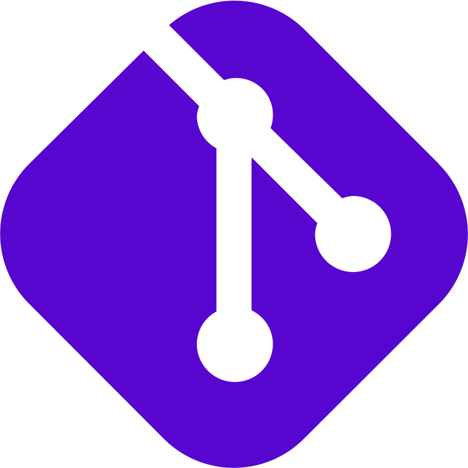
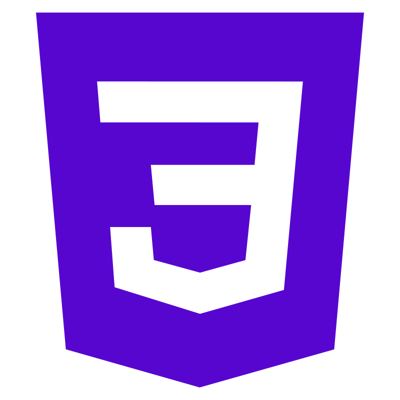

<h1 align="center">Hi 👋 My name is Mateusz,</h1>

 

  
 As a self-taught software engineer, I specialize in building full-stack web applications and have had the privilege of collaborating with talented engineers from across the globe. I am captivated by the power of technology in solving complex problems. Additionally, I find immense joy in travelling, and for more than a decade, I have resided in various countries, immersing myself in different cultures and embracing diverse perspectives. This rich life experience, coupled with my diverse professional background, has honed my ability to think innovatively and draw upon a broad range of references, giving me a unique edge in problem-solving.

## 
Skills

  
   
  

  
  
  
    
  
 

 

---
<!-- project display table -->
 

## Connect with me

  
  

  

<!-- 
**MateuszKomasara/MateuszKomasara** is a ✨ _special_ ✨ repository because its `README.md` (this file) appears on your GitHub profile.

Here are some ideas to get you started:

- 🔭 I’m currently working on ...
- 🌱 I’m currently learning ...
- 👯 I’m looking to collaborate on ...
- 🤔 I’m looking for help with ...
- 💬 Ask me about ...
- 📫 How to reach me: ...
- 😄 Pronouns: ...
- ⚡ Fun fact: ...
-->
