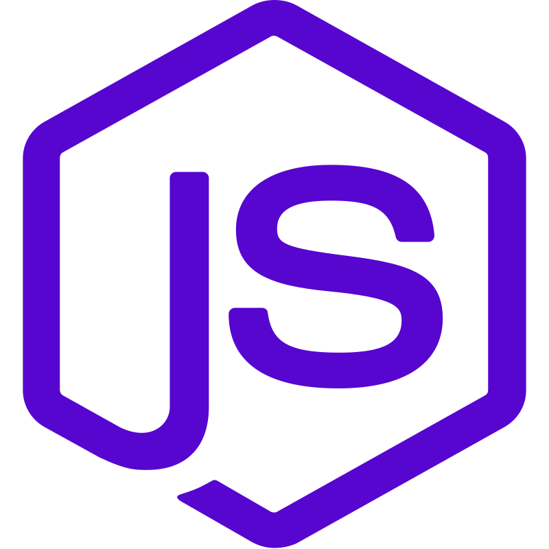
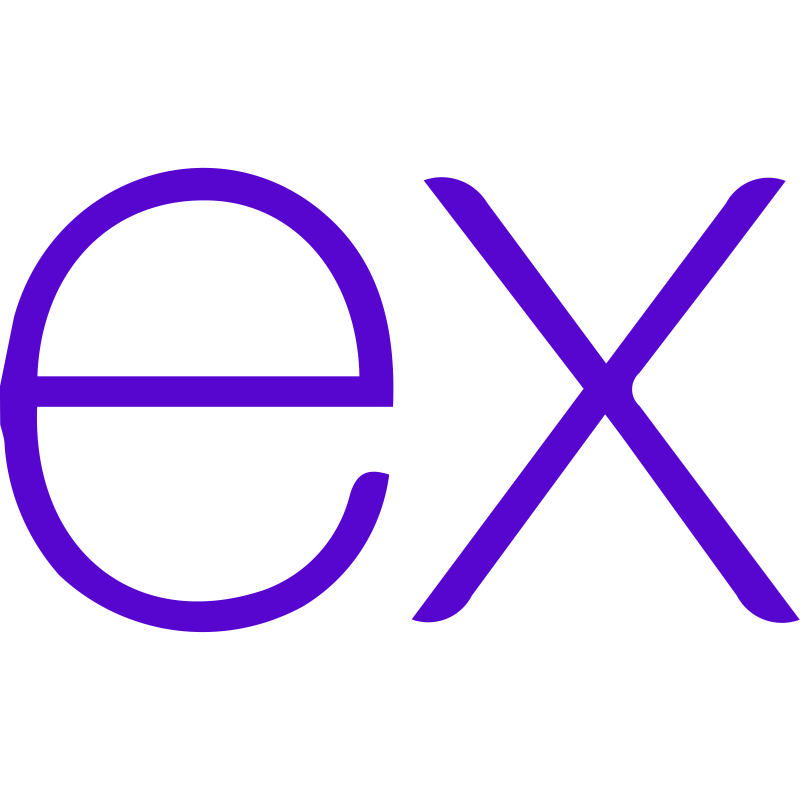
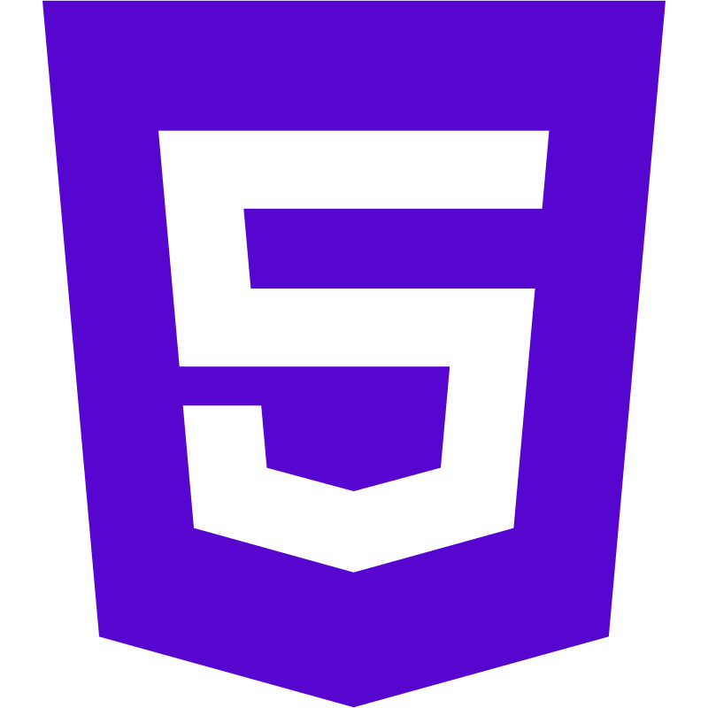

<h1 align="center">Hi 👋 My name is Mateusz,</h1>

 

  
 As a community taught software engineer, I build full stack web applications and have collaborated with talented engineers from around the world. I am fascinated by the ability to solve problems utilizing technology, I also enjoy travelling and spent over a decade living and travelling overseas. This life experience working in a variety of jobs and interacting with a plethora of cultures and personalities has given me an edge in my ability to think outside of the box and to have a greater degree of reference.

## 
Skills

  
  
  
  
  
  
  
  
  
 

 

<!-- PROJECTS -->

<h2 align="center" color="white">Projects</h2>

	<table>
		<tr>
			<!--project 1 -->
			<td width="50%">
				<h3 align="center" color="white">Five Line Rhyme</h2>
				
 
					
					 
					 
					

                        <!--repo --> 
						  
                        <!--live site --> 
							
					

					<h5>JavaScript, CSS, Node, Express, Pug, MongoDB, Mongoose, Cloudinary</h5>
					
A collection of poems only 5 lines long

				

		<!--project 2 -->
			<td width="50%">
				<h3 align="center" color="white">Budget Tracker</h2>
				
 
					
					 
					 
					

                        <!--repo --> 
						  
                        <!--live site --> 
							
					

					<h5>JavaScript, CSS, HTML, Node, Express, EJS, MongoDB, Mongoose</h5>
					
Track your monthly expenses

				

			</td>
		<tr>
			<!--project 3 -->
			<td width="50%">
				<h3 align="center" color="white">PAIHS Portfolios</h2>
				
 
					
					 
					 
					

                        <!--repo --> 
						  
                        <!--live site --> 
							
					

					<h5>JavaScript, CSS, HTML</h5>
					
An introduction to PBATS and Mentoring at PAIHS

				

			</td>
			<!--project 4 -->
			<td width="50%">
				<h3 align="center" color="white">Coding Resources API</h2>
				
 
					
					 
					 
					

                        <!--repo --> 
						  
                        <!--live site --> 
							
					

					<h5>JavaScript, CSS, HTML, Node, Express</h5>
					
Search for over 50 resources filterable by keywords

				

	</table>

---

 

## Connect with me

  
  

 

  

<!-- 
**MateuszKomasara/MateuszKomasara** is a ✨ _special_ ✨ repository because its `README.md` (this file) appears on your GitHub profile.

Here are some ideas to get you started:

- 🔭 I’m currently working on ...
- 🌱 I’m currently learning ...
- 👯 I’m looking to collaborate on ...
- 🤔 I’m looking for help with ...
- 💬 Ask me about ...
- 📫 How to reach me: ...
- 😄 Pronouns: ...
- ⚡ Fun fact: ...
-->
